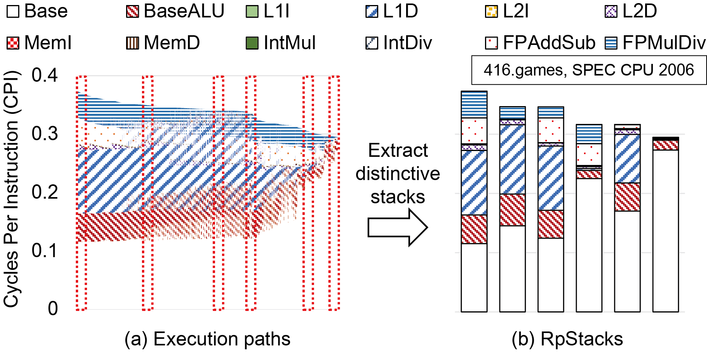
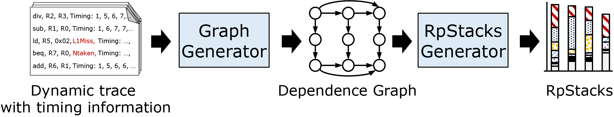

## RpStacks

RpStacks is a _fast_ and _accurate_ design space exploration method for modern processors.
Unlike cycle-level simulators, which analyze the details of a single design point,
RpStacks targets evaluating a large number of desgin points,
bearing a large-size design space in mind at the development stage.
It exploits _Representative Stall-Event Stacks_, which capture a target design's secondary bottlenecks as well as primary ones.

RpStacks provides the following features:

* __Fast__ design space evaluation speed, agnostic to # of designs
* __Accurate__ performance esitmation

## Representative Stall-Event Stack
### Basics: CPI Stacks
CPI stacks are intuitive ways to analyze the bottleneck of a target design.
They account for the effects of outstanding bottlenecks, such as cache misses and branch misses, on the critical path.
Computer architects estimate the performance of design changes (e.g., alleviating cache misses) by scaling the corresponding components of the CPI stack.
However, a modern processor executes multiple instructions simultaneously in out-of-order.
The bottleneck events overlap, and thus the outstanding bottlenecks hide the secondary ones, which could be revealed when a design change mitigate the outstanding ones.
The traditional CPI stacks fail to consider such effects of the secondaries.


### Representaive Stall-Event Stacks?

<p align="center">
  
</p>

Representative stall-event stacks are a set of CPI stacks, each of which has a distinct composition.
They extend the traditional CPI stacks to consider the secondary bottlenecks as well as the primary ones.
To consider all hidden bottlenecks, we track execution paths following the dependences of pipeline events instructions undergo.
However, since, along with a complex processor design, a workload consists of many instructions reaching trillions,
there are a countless number of execution paths, i.e., CPI stacks.
The above left figure (a) shows tremendous number of paths of 416.games, represented in CPI stacks.
Thanks to the inherent repeatability of workloads (such as loops),
we can condense them into a small number of representative paths that shows a distinct composition of pipeline penalties.
The figure (b) lists the representative paths, and we call them representative stall-event stacks.

### How do they help the design space exploration?

Representative stall-event stacks allow architects to estimate the performance of new designs without further simulations.
Each representative stall-event stack matches with the current or hidden bottleneck of a processor,
which could be a critical one when the design changes.
With the stacks, we can estimate the performance changes on the design changes.
We only need to scale the affected components of stacks and pick the longest one.
That is a new critical bottleneck and determines the performance of a new design.
For instance, we develop a new processor that reduces the L1 miss latency of the previous one by half.
Then, we reduce L1D components of representative stall-event stacks generated from the prior design and pick the longest stack.

## Framework

<p align="center">
  
</p>

The framework of RpStacks consists of two generators for (1) a dependence graph and (2) representative stall-event stacks.
The graph generator takes an instruction trace recording detailed pipeline timings as an input
and build a dependence graph.
The dependence graph models the behavior of a target processor as the dependencies between pipeline events instructions suffer.
The details description of the timing trace and the graph model are explained in the following links:
* [Detailed Timing Trace Format](subpages/trace_format.md)
* [Dependence Graph Structure](subpages/graph_struct.md)

The rpstacks generator extracts representative stall-event stacks from the graph model.
By manipulating the extracted stacks, we evaluate the performance of new designs without simulations.

## How to Run

### Build
```sh
# To build the source code
# make would create the exectable "builder" in top directory
make
# To build it with debugging symbols
make DEBUG=1
# To clean up the executables and compiled objects
make clean
```

### Execute
To extract RpStacks, we need timing traces for a baseline design to explore. (refer [this page](subpages/trace_format.html)).
By way of demonstration, we use a sample trace (400.perlbench) in "sample_trace" directory.
This sample trace records the pipline timings of our baseline processor design.

```sh
# 1. Create a dependency graph from a given timing trace.
# ./builder -k < "Input trace path" > "output graphfile path"
./builder -k < sample_trace/400.perlbench.trace > 400.perlbench.graph
# 2. Extract RpStacks from the generated graph.
mkdir rpstacks
./builder -g --merge-threshold 100000                     \
	  --merge-interval 5000 --cos-th 0.7              \
	  --saveuniq 1 --uniqlen 1000000                  \
	  --saveshare 1 --ofprefix=rpstacks/400.perlbench \
	  < 400.perlbench.graph
```
Now, we have RpStacks for the sample trace (400.perlbench).
```
$ ls rpstacks
perlbench_0    perlbench_127  perlbench_156  perlbench_185
perlbench_1    perlbench_128  perlbench_157  perlbench_186
perlbench_10   perlbench_129  perlbench_158  perlbench_187
perlbench_100  perlbench_13   perlbench_159  perlbench_188
perlbench_101  perlbench_130  perlbench_16   perlbench_189
perlbench_102  perlbench_131  perlbench_160  perlbench_19
perlbench_103  perlbench_132  perlbench_161  perlbench_190
perlbench_104  perlbench_133  perlbench_162  perlbench_191
perlbench_105  perlbench_134  perlbench_163  perlbench_192
perlbench_106  perlbench_135  perlbench_164  perlbench_193
...
```
Each file consists of three sections: interval size, critical path, reduced path.
The snippet below is the example of a RpStack file, *perlbench_0*.
The first line shows the number of instruction this RpStacks covers.
*Perlbench_0* has RpStacks from the first 5001 instructions from the trace.
The next section, _Critical Path_ lists the corresponding *representative stall stacks*.
The last section, Reduced Path shows the distictive stacks that summarize the representative ones.
```
5001
Critical Path
1278 0 0 0 0 0 0 0 0 0 0 355 0 0 0 0 0 0 0 355 0
1249 0 0 0 0 0 0 0 0 0 0 384 0 0 0 0 0 0 0 384 0
1587 0 0 0 0 0 0 0 0 0 0 0 0 0 0 0 0 0 0 0 0
1578 0 0 0 0 0 0 0 0 0 0 22 0 0 0 0 0 0 0 22 0
1362 0 331 0 0 0 0 0 0 0 0 0 0 0 0 0 0 0 0 0 0
1576 0 37 0 0 0 0 0 0 0 0 0 0 0 0 0 0 0 0 0 0
1578 0 25 0 0 0 0 0 0 0 0 0 0 0 0 0 0 0 0 0 0
...
Reduced Path
1543 0 37 0 0 0 0 0 0 0 0 45 0 0 0 0 0 0 0 45 0
1337 0 339 0 0 0 0 0 0 0 0 25 0 0 0 0 0 0 0 25 0
1239 0 37 0 0 0 0 0 0 0 0 382 0 0 0 0 0 0 0 382 0
1319 0 334 0 0 0 0 0 0 0 0 63 0 0 0 0 0 0 0 63 0
1005 0 385 0 0 0 0 0 0 0 0 499 0 0 0 0 0 0 0 499 0
1576 0 37 0 0 0 0 0 0 0 0 0 0 0 0 0 0 0 0 0 0
```

Now, we have representative stall-event stacks for the baseline design.
To evaluate the performance of design changes,
we need to adjust the size of pentalties in each stack according to the changes.
We provide a python script "apply_penalty.py" to manipulate the produced stacks.

```bash
# Usage: ./apply_penalty.py <rpstacks directory> <file prefix>
# Baseline CPI
./apply_pernalty.py --cpi rpstacks 400.perlbench
# The script's output
# ==================== Stack Info ====================
# base 0.209255045434
# l1i 0.0
# l1d 0.0758201234291
# l2i 0.0
# l2d 1.6724738676e-05
# mem_i 0.0
# mem_d 0.0
# intmul 0.0
# intdiv 0.0
# fpaddsub 0.0
# fpmuldiv 0.0
# br 0.0968769213361
# ====================================================
# CPI 0.381968814938

# CPI of a changed design with the half of the L2I$ latency.
./apply_penalty.py --cpi --l2i=0.5 rpstacks perlbench
# The script's output
# ==================== Stack Info ====================
# base 0.209848687834
# l1i 0.0
# l1d 0.0378292385737
# l2i 0.0
# l2d 1.6724738676e-05
# mem_i 0.0
# mem_d 0.0
# intmul 0.0
# intdiv 0.0
# fpaddsub 0.0
# fpmuldiv 0.0
# br 0.0964449252182
# ====================================================
# CPI 0.344139576364

# To get available options
./apply_penalty.py --help
```

### FAQ
### Cycle-level simulators vs. RpStacks

A cycle-level simulator is an invaluable tool computer architects have been used.
It analyzes the detailed cycle-level behavior of a single design point.
Although it is a right tool for analyzing a single design point,
It does not work for exploring a large design space due to its slow simulation speed.
As the number of required simulations increases with the size of design space,
using simulators is not scalable.
As a result, architects end up with evaluating only a few number of design points.

On the other hands, RpStacks provides a scalable method for exploring a large design space.
RpStacks predicts the performance of various design points with a negligible overhead by exploiting the detaild analysis results, rpresentative stall-event stacks of a baseline design.
As only a single simulation is required to generate the representative stall-event stacks,
the exploration with RpStacks is scalable and its speed is agnostic to the size of design space.

In conclusion, cycle-level simulators and RpStacks focus on respective scopes, a single design point vs. a large design space.
RpStacks enables architects to explore a large design space, helping them find optimal design points.
Cycle-level simulator can be used to further analyze the found points for fine-tuning.

### Publications

If you use rpstacks in your research, we would appreciate citations to the following papers:

**[RpStacks-MT: A High-throughput Multi-core Processor Design Evaluation Methodology](pubs/rpstacks_mt.pdf)**<br>
Hanhwi Jang, Jae-Eon Jo, Jaewon Lee, and Jangwoo Kim<br>
51th IEEE/ACM International Symposium on Microarchitecture (MICRO), Oct. 2018<br>

**[RpStacks: Fast and Accurate Processor Design Space Exploration Using Representative Stall-Event Stacks](pubs/rpstacks.pdf)**<br>
*Jaewon Lee, *Hanhwi Jang, Jangwoo Kim<br>
*These authors contributed equally to this work.<br>
47th IEEE/ACM International Symposium on Microarchitecture (MICRO), Dec. 2014
