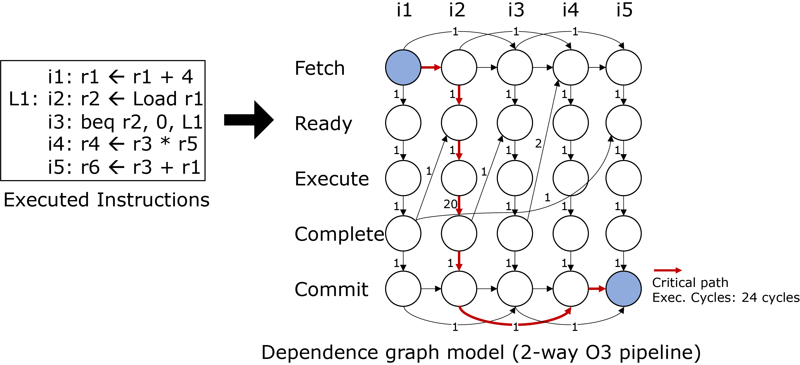
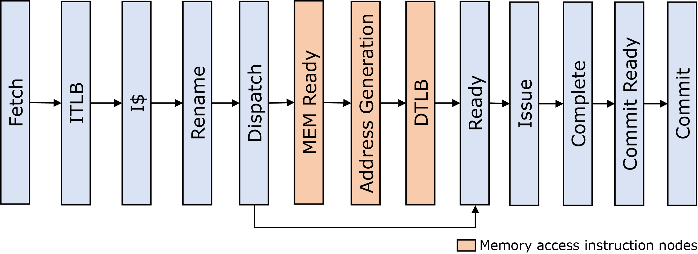

## Dependence Graph

  

A dependence graph model is an abstraction model of a processor,
which describes the execution behavior of a workload on the processor as a graph.
The above figure shows an example that models a 2-way superscalar out-of-order processor executing five instructions.
A column of nodes represents the pipeline stages of the processor where a single instruction goes.
The first column of this example models the first instruction, _i1_.
The edge connecting two nodes describes the dependency of pipeline stages
(e.g., the sequence of pipeline stages, inorder-fetch, data dependencies),
and its weight indicates when the next stage can proceed.
As a result, the longest path from the first node (Fetch node of the first instruction) to the last node (Commit node of the last instruction),
or critical path, determines the execution time of the workload running on the modeled processor.

### Dependence Graph for Out-of-order Processor
We currently provide a graph model for an out-of-order processor.
As listed in the following figures, our graph model has a 13-stage (logical) pipeline.

  

Three stages in red color (Memory Ready, Address Generation, DTLB) are for memory-type instructions.
We leave the description of nodes and edges in the below.
For more information, check our paper [MICRO2014] and the source files "graph.[cc,hh]."

#### Node descriptions
* F, start of instruction fetch
* ITLB, ITLB access done
* I$, I-Cache access done
* N, register renaming and re-order buffer entry allocation
* D, issue queue entry allocation
* AR1, all data operands for address calculation ready, except address calculation unit
* AR2, address calculation
* DTLB, DTLB access done
* R, all data operands ready, except functional unit
* E, execution
* P, execution complete
* RC, ready to commit
* C, commit.

#### Edge descriptions

| Constraint | Edge | Description |
| ---------------------- |---------- | ------------------|
| In-order fetch | I$i-1&rarr;Fi | |
| Finite fetch bandwidth | I$i-fbw&rarr;Fi | where _fbw_ is the maximum number of instructions that can be fetched in a cycle |
| Finite fetch buffer size | Ni-fbs&rarr;Fi | where _fbs_ is the fetch buffer size |
| Control dependency | Ii-1&rarr;Fi | inserted if instruction _i_ - 1 is mispredicted branch |
| ITLB access latency | Fi&rarr;ITLBi | is 0 in case of ITLB hit |
| I$ access latency | ITLBi&rarr;I$i | is 0 in case of I$ hit 
| Rename after I$ access | I$i&rarr;Ni | 
| In-order rename | Ni-1&rarr;Ni |
| Finite reorder buffer| Ci-rbs&rarr;Ni | where _rbs_ is the re-order buffer size 
| Finite rename bandwidth | Ni-nbw&rarr;Ni | where _nbw_ is the maximum number of instruction that can be processed at the rename stage in a cycle
| Dispatch after rename | Ni&rarr;Di | 
| In-order dispatch | Di-1&rarr;Di |
| Issue dependency | Ej&rarr;Di | prefer to select instruction _j_ waiting for the result of an optimizable long-latency instruction (modeling the issue dynamics) |
| Finite dispatch width| Di-dbw&rarr;Di | where _dbw_ is the maximum number of instructions which can be dispatched in a cycle 
| Ready after dispatch | Di&rarr;AR1i | 
| Data dependency | Pj&rarr;AR1i | inserted if a ld/st instruction _i_ depends on previous instruction  _j_'s result for address calculation
| Address calculation | AR1i&rarr;AR2i |
| DTLB access latency | AR2i&rarr;DTLBi |
| Ready after dispatch | Di&rarr;Ri | 
| Finite physical registers | Cj&rarr;Ri | inserted if instruction _j_ releases the physical register instruction _i_ will use
| Data dependency | Pj&rarr;Ri| inserted if instruction _i_ depends on previous instruction _j_'s result
| Ready after DTLB access | DTLBi&rarr;Ri | inserted if the instruction _i_ is load or store
| Execute after ready | Ri&rarr;Ei | 
| Address dependency | Ej&rarr;Ei| every load _i_ can be executed after all stores _j_  $<$  _i_ be executed or at the same time 
| Completion after execute | Ei&rarr;Pi |
| Cache line sharing | Pj&rarr;Pi | inserted if load _i_ and load _j_ has the same address 
| In-order commit | Ci-1&rarr;RCi|
| Finite commit width | Ci-cbw&rarr;RCi |
| uop dependecy | Pj&rarr;RCsom| inserted for all instruction _j_ $>=$ p _som_ where _som_ is start of macro op instruction
| Commit latency | RCi&rarr;Ci	   | |

