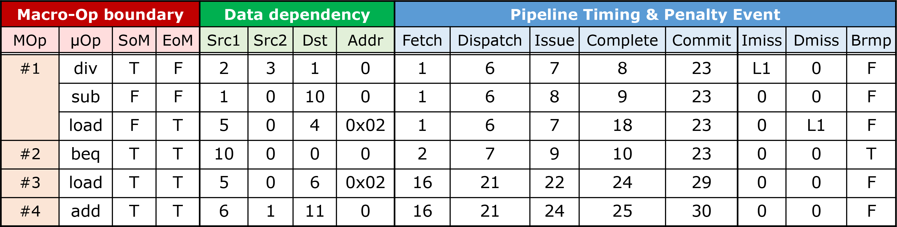

## Detailed Timing Trace

RpStacks requires a detailed timing trace to build a processor dependence graph model.
The detailed timing trace records the exact pipeline timing of executed instructions (e.g., when an instruction is fetched)
and lots of information required to track the dependencies of pipeline events
(i.e., the register indices and a memory address each instruction reads and writes). 

Generating the detailed timing trace requires cycle-level simulators.
We disclose the trace format RpStacks uses.
The format design is primarily after a superscalar out-of-order core modeled in PTLsim,
but it is generic as much as possible to cover various out-of-order core models in other simulators with slight modifications. 

### Trace Format

  

This table shows the snippet of the detailed timing trace.
Each row represents the information of an executed instruction (e.g., opcode name, register indices) and its pipeline event timing.
Here, we use x86-64 ISA, so each instruction means a micro-op, which is internally used in the pipeline.
As a single instruction in x86-64 ISA or micro-op could consist of multiple micro-ops,
we record whether each row is the start or the end of the micro-op (SOM/EOM).
For more detail, refer trace format header file, 'inst.hh.'

